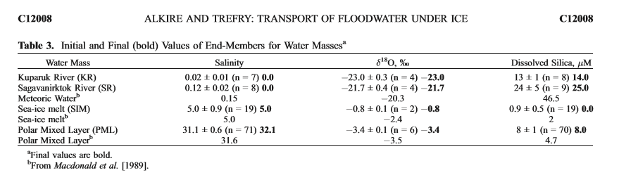

```{r setup, include=FALSE}
knitr::opts_chunk$set(echo = TRUE)
library(tidyverse)
library(lubridate)
library(cowplot)
```

```{r, echo=FALSE, message=FALSE, warning=FALSE}
YSI <- read_csv("All_BLE_Sonde_Data_2018_2019.csv", col_types = cols(date_time = col_date(format = "%m/%d/%Y"))) %>% 
  rename(Date_collected=date_time)
#note; changed date of summer 2019 STL bc times near midnight and YSI was technically collected on a diff day than 18O

O18 <- read_csv("BLE LTER 18O.csv", col_types = cols(Date_collected = col_date(format = "%m/%d/%Y"))) %>% 
  arrange(Date_collected, Station)

```

```{r, echo=FALSE, message=FALSE, warning=FALSE}
input <- left_join(O18,YSI, by=c("Station"="station","Date_collected","WaterColumnDepth"="water_column_position")) %>% 
  select(Node, Lagoon, Station, Date_collected, DepthCat=WaterColumnDepth, Sal=sal, delta_18O) %>% 
  mutate(Season=case_when(month(Date_collected)==7|month(Date_collected)==8 ~ "Summer",
                          month(Date_collected)==6 ~ "Break-up",
                          month(Date_collected)==4 ~ "Under-ice"),
         Habitat= case_when(grepl("R", Station) ~ "River",
                            grepl("D", Station) ~ "Deep",
                            TRUE ~"Shallow"))%>%
  drop_na(-DepthCat)


input$DepthCat[is.na(input$DepthCat)] <- "surface"
input$DepthCat <- factor(input$DepthCat, levels=c("surface","bottom"))
input$Habitat <- factor(input$Habitat, levels=c("River","Shallow","Deep"))
input$Lagoon <- factor(input$Lagoon, levels=c("Elson","Simps","Steff","Kakto","Jago"))
input$Station <- factor(input$Station, levels=c("AVR1","MYR1","NNR1",
                                            "EWLS1","EWLS2","EWLD1","EWLD2",
                                            "EELS1","EELS2","EEL1","EELD2",
                                            "KUR1","SILS1","SILS2","SILD1","SILD2",
                                            "SAR1","STLS1","STLS2","STL1","STLD2",
                                            "KALS1","KALS2","KALD1","KALD2",
                                            "JAR1","JALS1","JALS2","JAL1","JALD2"))

```


```{r, echo=FALSE, message=FALSE, warning=FALSE}

Pal <- c('#625989', '#636591', '#657298', '#677f9f', '#6a8ba5', '#6e98aa', '#72a4ae', '#78b1b1', '#80bdb2', '#8ac9b0', '#96d6ac', '#a4e1a4', '#b7ed95', '#cef879', '#e4f361', '#cce75b', '#b8da55', '#a7cc4f', '#9abd48', '#91ae41', '#8a9f39', '#868f32', '#847e2a', '#836d21', '#835b19', '#834710', '#842f08', '#840000')

ggplot(input, aes(Sal, delta_18O))+
  geom_point(aes(color=Season, shape=Habitat), size=3, alpha=.7)+
  geom_text(aes(label=Station), size=2)+
  facet_wrap(~Lagoon)+
  scale_color_manual(values=Pal[c(1,10,20)])+
  theme_cowplot()

#need to figure out WHICH June EELS2 is which

ggplot(input, aes(Lagoon, delta_18O))+
  geom_jitter(aes(color=Season), width = 0.2)+
  facet_grid(Habitat*DepthCat~., scales="free")+
  scale_fill_manual(values=Pal[c(1,10,20)])+
  theme_cowplot()
```
###Our river end members vary a lot by node: should we seperate the analyses?
```{r riverO, echo=FALSE, message=FALSE, warning=FALSE}
input %>% filter (Habitat=="River") %>% 
  ggplot(aes(Station,delta_18O))+
  geom_jitter(aes(color=Season), size=3)+
  scale_color_manual(values=Pal[c(1,20)])+
  facet_grid(.~Lagoon, scales="free")+
  theme_cowplot()
```
#mountain precip is more negative (bc high elevation is akin to higher latitude)


##Endmembers from Alkire and Trefrey 2006



$SIM+MW+PML = 1$

$5*SIM + 0*MW + 32.1*PML =  S$ 

$-2.4*SIM + -22*MW + -3.5*PML = O$

```{r create_function, echo=FALSE, message=FALSE, warning=FALSE}


calc_source <- function(S, O){
  
  A <- matrix(data=c(1, 1, 1, 5, 0, 32.1, -2.4, -20.3, -3.5), nrow=3, ncol=3, byrow=TRUE)    
  b <- matrix(data=c(1, S, O), nrow=3, ncol=1, byrow=FALSE)
  
  x <- round(solve(A, b), 3)
  
  #tx <- t(x)
  
  #return(as.matrix(tx))
  return(x)
}

```

```{r calculate_fractions, echo=FALSE, message=FALSE, warning=FALSE}

a <- matrix(ncol=3, nrow=nrow(input))
for(i in 1:nrow(input)){
  a[i,] <- calc_source(input$Sal[i], input$delta_18O[i])
}

a <- as.data.frame(a)

colnames(a)=c("SIM","MW","PML")

data <- bind_cols(input,a)


```

```{r for_plot, echo=FALSE, message=FALSE, warning=FALSE}
a2 <- as.data.frame(a, col.names=c("SIM","MW","PML"))

colnames(a2)=c("SIM","MW","PML")

data2 <- bind_cols(input,a2) %>% 
  pivot_longer(cols=SIM:PML, names_to = "Source")

```

```{r mean_plot, echo=FALSE, message=FALSE, warning=FALSE, fig.height=8, fig.width=11}
data_means <- bind_cols(input,a2) %>% 
  pivot_longer(cols=SIM:PML, names_to = "Source") %>% 
  group_by(Lagoon, Station, DepthCat, Habitat, Season, Source) %>% 
  summarize(mFrac=mean(value))

data_means %>% filter(Habitat!="River") %>% 
  ggplot(aes(Station, mFrac))+
  geom_col(aes(fill = Source), position = position_stack(reverse = TRUE)) +
  coord_flip() +
  facet_grid(Lagoon*Habitat ~ Season*DepthCat, scales="free")+
  theme_cowplot()+
  theme(strip.text.x = element_text(size = 8))
```

```{r table, echo=FALSE, message=FALSE, warning=FALSE}
table1 <- data_means %>%
  mutate(mFrac=mFrac*100) %>% 
  pivot_wider(names_from=Source, values_from=mFrac)
```

```{r table_ave, echo=FALSE, message=FALSE, warning=FALSE}
table2 <- data_means %>% 
  filter(Habitat!="River") %>% 
  group_by(Lagoon, DepthCat, Season, Source) %>% 
  summarize(meanFrac=mean(mFrac))%>%
  mutate(meanFrac=meanFrac*100) %>% 
  pivot_wider(names_from=Source, values_from=meanFrac)


data_means %>% 
  filter(Habitat!="River") %>% 
  group_by(Lagoon, DepthCat, Season, Source) %>% 
  summarize(meanFrac=mean(mFrac))%>%
  ggplot(aes(Lagoon, meanFrac))+
  geom_col(aes(fill = Source), position = position_stack(reverse = TRUE)) +
  coord_flip() +
  facet_grid(DepthCat~Season, scales="free")+
  theme_cowplot()+
  theme(strip.text.x = element_text(size = 8))
```


```{r, echo=FALSE, message=FALSE, warning=FALSE}
input %>% filter(Habitat=="River") %>% 
  group_by(Station) %>% 
  summarize(mSal=mean(Sal))
```


